# saga UX Design Specification

_Created on 2025-11-14 by Tenny_
_Generated using BMad Method - Create UX Design Workflow v1.0_

---

## Executive Summary

SuiSaga is an AI-driven "Living World" built on Sui blockchain that enables thousands of players to create permanent, blockchain-verified changes in an evolving universe. The core innovation combines asynchronous processing, AI-driven world logic, and provable history to solve modern gaming challenges around player disengagement and artificial reputation systems.

The target users - impact-driven modern gamers, digital legacy builders, and collaborative world shapers - seek meaningful engagement in short sessions (5-15 minutes) and want to create authentic digital legacies. The platform is web-based with Node.js backend and vanilla HTML/CSS/JS frontend for maximum hackathon compatibility.

**Core Experience:** Users take actions that create lasting world impact, visualized through blockchain proof cards and cascading world effects. The emotional goal is empowerment - users should feel powerful and capable of creating permanent change.

**UX Inspiration:** Drawing from Slack's real-time collaboration patterns, Notion's flexible content architecture, and Figma's interactive visualization systems to create a clean, innovation-focused interface that demonstrates the "Asynchronous World" architecture effectively within hackathon constraints.

---

## 1. Design System Foundation

### 1.1 Design System Choice

**Chosen Design System:** shadcn/ui

**Rationale:** shadcn/ui is ideal for SuiSaga's hackathon demo and innovation showcase needs:

- **Modern Clean Aesthetic:** Perfect for highlighting blockchain innovation without visual clutter
- **Tailwind CSS Foundation:** Fast, flexible styling for rapid hackathon development
- **Accessibility Built-in:** WCAG compliance components ensuring demo accessibility
- **Lightweight & Performant:** Fast loading times critical for demo reliability
- **Component Modularity:** Can pick only needed components, keeping bundle size small
- **Customizable Theming:** Easy to create unique blockchain-themed color schemes
- **Active Community:** Recent updates and extensive documentation for hackathon troubleshooting

**Components Provided:** 40+ high-quality React components including buttons, cards, forms, modals, navigation, data displays, and feedback systems - perfect for proof cards, cascade visualizations, and activity monitoring interfaces.

**Custom Components Needed:** Specialized blockchain verification displays, cascade effect diagrams, real-time activity indicators, and world state visualization widgets.

**Version:** Latest stable (shadcn/ui actively maintained with regular updates)

---

## 2. Core User Experience

### 2.1 Defining Experience

**Defining Experience:** **"Action-to-Impact with Immediate Proof"** - users take world-changing actions and immediately see blockchain-verified proof cards while AI processes cascading world effects asynchronously.

This core experience differentiates SuiSaga from traditional games through:
- **Immediate Confirmation:** Users see their action recorded instantly with blockchain proof
- **Transparent Processing:** Real-time visualization of AI calculating world changes
- **Permanent Impact:** Verifiable proof cards that other players can discover
- **Collaborative Discovery:** Users explore how their actions interact with others' changes

**Primary Action Loop:**
1. **Action Input** (2-5 seconds): User selects world-changing action
2. **Immediate Proof** (0.1 seconds): Blockchain verification link generated
3. **Processing Visualization** (15 seconds): AI calculates cascading effects
4. **Impact Revelation** (2-3 seconds): World changes displayed with proof cards

**Why This Defines SuiSaga:**
- Demonstrates all three core innovations (blockchain + AI + async processing)
- Creates emotional empowerment through visible, permanent impact
- Enables hackathon "15-second wonder" demonstration
- Differentiates from static games with isolated consequences

### 2.2 Novel UX Patterns

**Pattern 1: Asynchronous Impact Visualization**
- **Challenge:** Show 15-second AI processing without users feeling stuck
- **Solution:** Real-time cascade diagrams showing butterfly effects being calculated
- **States:** Queued → Analyzing → Calculating Effects → Applying → Completed
- **Visual:** Animated flow diagram from user action through world systems

**Pattern 2: Blockchain Proof Cards**
- **Challenge:** Make blockchain verification compelling and understandable
- **Solution:** Interactive proof cards showing action history with clickable verification
- **Elements:** Action summary, world impact, verification link, reputation change
- **Interaction:** Share, explore related actions, view blockchain transaction

**Pattern 3: Multiplayer Activity Timeline**
- **Challenge:** Show asynchronous multiplayer without requiring coordination
- **Solution:** Real-time activity feed showing how actions affect shared world
- **Features:** Live player count, recent actions, collaborative achievements
- **Discovery:** Click any action to see its proof card and world impact

**Pattern 4: World State Evolution Browser**
- **Challenge:** Users explore how world has evolved from collective actions
- **Solution:** Interactive timeline showing before/after world states
- **Navigation:** Filter by player, time period, world area, action type
- **Visualization:** State changes with proof links to specific actions

---

## 3. Visual Foundation

### 3.1 Color System

**Chosen Theme:** **Retro Gaming High Contrast** - Old-school arcade feel with dark backgrounds and vibrant, accessible colors

**Color Palette:**
- **Primary Background:** #0a0a0a (Deep black - classic arcade cabinet feel)
- **Secondary Background:** #1a1a1a (Dark charcoal for content areas)
- **Primary Accent:** #00ff41 (Neon green - classic terminal/hacking aesthetic)
- **Secondary Accent:** #ff0080 (Neon pink - gaming energy)
- **Success Color:** #00ff41 (Bright green - clearly distinguishable)
- **Warning Color:** #ffaa00 (Amber - high contrast, avoid yellow alone)
- **Error Color:** #ff3366 (Coral red - distinct from success)
- **Info Color:** #00ccff (Cyan - clearly different from other colors)
- **Primary Text:** #ffffff (Pure white for maximum readability)
- **Secondary Text:** #cccccc (Light gray for less important text)
- **Border/Dividers:** #333333 (Subtle dark borders)

**Typography System:**
- **Headings:** 'Courier New', monospace (retro terminal feel)
- **Body Text:** 'Roboto Mono', monospace (readable monospace for technical feel)
- **UI Elements:** 'VT323' or 'Press Start 2P' (optional pixel fonts for pure retro)

**Spacing System:**
- **Base Unit:** 4px (consistent with retro grid systems)
- **Scale:** 4px, 8px, 12px, 16px, 24px, 32px, 48px
- **Layout Grid:** 12-column system for structure

**Retro Design Elements:**
- **Scanlines:** Subtle animated scanline effect for CRT monitor feel
- **Pixel Borders:** 1px bright borders around interactive elements
- **Glow Effects:** Soft neon glow on primary actions and important elements
- **Terminal Aesthetics:** Monospace fonts with command-line style interactions
- **8-bit Icons:** Simple, recognizable pixel art style icons

**Accessibility Considerations:**
- **High Contrast:** All text meets WCAG AAA contrast ratios on dark backgrounds
- **Color-Blind Friendly:** Success (green) and Error (red) are clearly distinguishable shapes and positions, not just colors
- **Focus Indicators:** Bright neon outline (2px) on all interactive elements
- **Keyboard Navigation:** All actions accessible via Tab/Enter keys
- **Screen Reader Support:** Clear ARIA labels and semantic HTML structure

**Interactive Visualizations:**

- Color Theme Explorer: [ux-color-themes.html](./ux-color-themes.html)

---

## 4. Design Direction

### 4.1 Chosen Design Approach

**Chosen Direction:** **Arcade Gaming Interface** with retro high contrast styling

**Layout Decisions:**
- **Top Navigation Bar:** Game title with real-time score display
- **World Map Grid:** 3-column layout showing Village, Dragon Lair, Forest areas
- **Action Button Grid:** 2x4 button grid for primary game actions
- **Central Focus:** World areas prominently displayed with current status
- **Responsive:** Adapts to single column on mobile devices

**Visual Hierarchy:**
- **High Contrast:** Dark backgrounds (#0a0a0a) with neon accent colors
- **Bold Typography:** Press Start 2P pixel font for game title, VT323 for UI elements
- **Glowing Effects:** Neon glow on interactive elements and active states
- **Color-Coded Status:** Different colors for area states (battle ready, prosperous, mysterious)
- **Clear Visual Feedback:** Hover states, active states, and click animations

**Interaction Patterns:**
- **Grid-Based Navigation:** Click world areas to select and view details
- **Action-First Interface:** Primary game actions displayed prominently in grid
- **Real-Time Updates:** Live player count, score, and world statistics
- **Immediate Feedback:** Visual and animation responses to all interactions
- **Progressive Disclosure:** Area details expand on selection

**Visual Style:**
- **Retro Gaming Aesthetic:** Classic arcade cabinet styling with modern web technology
- **Neon Color Scheme:** Bright greens, cyans, and pinks against dark backgrounds
- **Pixel Art Elements:** Clean, modern interpretation of retro gaming visuals
- **Scanline Effects:** Subtle CRT monitor simulation for authenticity
- **High Contrast Design:** Maximum readability for hackathon presentation

**Rationale:** Perfect for hackathon demo success because:
- **Immediate Visual Impact:** Grabs judge attention within 2 seconds
- **Clear Innovation Showcase:** Clean layout highlights blockchain integration
- **Intuitive Game Feel:** Familiar arcade mechanics anyone can understand
- **Retro Innovation Theme:** Modern technology presented with classic gaming nostalgia
- **Hackathon Friendly:** Works perfectly on presentation screens and mobile devices

**Interactive Mockups:**

- Design Direction Showcase: [ux-design-directions.html](./ux-design-directions.html)

---

## 5. User Journey Flows

### 5.1 Critical User Paths

**Journey 1: First-Time User "15-Second Wonder" Demo**
*Goal: Demonstrate core innovation and create immediate impact*

**Entry Point:** Landing screen with "PRESS START" button
- **Screen 1:** Title screen with glowing "PRESS START" → Click to continue
- **Screen 2:** World overview showing 3 areas → Click "Dragon Lair" (highlighted for demo)
- **Screen 3:** Dragon Lair with HP bar and attack button → Click "⚔️ Attack"
- **Screen 4:** Action confirmation with blockchain proof → "Action recorded! Processing..."
- **Screen 5:** 15-second processing visualization with cascade diagram
- **Screen 6:** Results screen with proof card and world changes → Click "View Proof"

**Key Design Elements:**
- Visual progress indicator showing which step of the demo
- Prominent action button with glowing animation
- Real-time player count showing other users affecting world
- Blockchain verification link immediately visible
- Cascade diagram showing butterfly effects in real-time

**Journey 2: Returning Player - Explore World Evolution**
*Goal: Show how world has evolved since last session*

**Entry Point:** Main game screen showing current world state
- **Screen 1:** Arcade interface with updated score and statistics
- **Screen 2:** World map shows changes in areas (village prosperity, forest peace)
- **Screen 3:** Click "View World History" → Timeline of recent changes
- **Screen 4:** Click any change → See proof card and verification link
- **Screen 5:** "Discover other players' actions" → Activity feed of recent impacts
- **Screen 6:** Explore collaborative achievements → View group accomplishments

**Journey 3: Multiplayer Demonstration**
*Goal: Show asynchronous multiplayer coordination*

**Entry Point:** Multi-device setup screen
- **Screen 1:** Connection interface showing 3 devices connected
- **Screen 2:** Device 1 attacks dragon → Immediate confirmation
- **Screen 3:** Device 2 trades in village → Shows different concurrent action
- **Screen 4:** Device 3 explores forest → Third simultaneous action
- **Screen 5:** Big screen shows all actions affecting shared world state
- **Screen 6:** Results show how actions created collaborative world changes

**Design Considerations:**
- Each device shows same interface with different player names
- Real-time synchronization of world state across all devices
- Visual indicators showing which player made which changes
- Central screen shows combined impact visualization

**Flow Diagram:**

```mermaid
graph TD
    A[Start Demo] --> B[PRESS START]
    B --> C[Select Dragon Lair]
    C --> D[⚔️ Attack Action]
    D --> E[Blockchain Confirmation]
    E --> F[AI Processing Visualization]
    F --> G[Cascade Results]
    G --> H[View Proof Card]
    H --> I[Share Achievement]
```

**Error States and Recovery:**
- **Network Error:** "Connection lost - retrying..." with automatic retry
- **AI Processing Timeout:** "Processing taking longer - using cached response"
- **Blockchain Verification Failed:** "Proof link failed - action still recorded"
- **Demo Timeout:** "Time's up! Here's what we accomplished..." with summary

**Success States:**
- **Action Completed:** Glowing confirmation with proof card generation
- **Cascade Triggered:** Dramatic visualization of world changes
- **Multiplayer Success:** All devices show synchronized world state
- **Demo Complete:** Summary screen with "Want to try again?" option

---

## 6. Component Library

### 6.1 Component Strategy

**shadcn/ui Components to Use:**

**Base Components (from shadcn/ui):**
- **Button** - Customized with retro styling, neon glow effects, and pixel borders
- **Card** - Used for world area displays and proof cards with dark theming
- **Dialog/Modal** - For proof card details and blockchain verification
- **Badge** - For status indicators and achievement displays
- **Progress** - For action processing visualization
- **Avatar** - For player representations in multiplayer mode
- **Separator** - For visual divisions in retro styling
- **Skeleton** - For loading states during AI processing

**Custom Components Needed:**

**1. RetroButton**
- **Purpose:** Primary action buttons with arcade styling
- **Content:** Icon + text (e.g., "⚔️ Attack", "🛡️ Defend")
- **States:** Default, hover (glow), active (pressed), disabled (dimmed)
- **Variants:** Primary (green), secondary (cyan), danger (red), special (pink)
- **Behavior:** Click animation with pixel particles, sound effect trigger
- **Accessibility:** Full keyboard navigation, ARIA labels, high contrast

**2. WorldAreaCard**
- **Purpose:** Display world areas (Village, Lair, Forest) with status
- **Content:** Area name, status icons, player count, health bars
- **States:** Normal, selected, active (current location), processing
- **Variants:** Available, busy, locked, mysterious
- **Behavior:** Click to select, hover shows details, double-click to zoom
- **Accessibility:** Screen reader announces area status, keyboard navigation

**3. ProofCard**
- **Purpose:** Display blockchain verification and action results
- **Content:** Action summary, world impact, verification link, timestamp, hash
- **States:** Processing, verified, shared, viewed
- **Variants:** Compact, detailed, achievement, cascade
- **Behavior:** Click to expand, share functionality, verification link navigation
- **Accessibility:** Link labels, keyboard accessible, semantic HTML structure

**4. ProcessingVisualizer**
- **Purpose:** Show 15-second AI processing with real-time feedback
- **Content:** Progress stages, animated elements, status updates, time remaining
- **States:** Initializing, analyzing, calculating, applying, completed, error
- **Variants:** Full screen, inline, compact, expanded
- **Behavior:** Real-time status updates, cancel option, completion animation
- **Accessibility:** Progress announcements, keyboard controls, screen reader support

**5. MultiplayerMonitor**
- **Purpose:** Display real-time multiplayer activity and world changes
- **Content:** Player count, activity feed, collaboration indicators, world sync status
- **States:** Connected, syncing, conflict detected, offline
- **Variants:** Minimal, detailed, tournament, presentation
- **Behavior:** Real-time updates, player filtering, interaction highlighting
- **Accessibility:** Live region announcements, keyboard navigation, contrast optimization

**6. RetroScoreDisplay**
- **Purpose:** Display game score, reputation, and achievement points
- **Content:** Score number, rank indicators, achievement badges, high scores
- **States:** Normal, new high score, achievement unlocked, level up
- **Variants:** Compact, expanded, leaderboard, tournament
- **Behavior:** Animated number changes, celebration effects, sharing options
- **Accessibility:** Number announcements, keyboard access, color-blind friendly

**Customization Requirements for shadcn/ui Components:**

**Button Customization:**
- Override default styling with retro theme colors
- Add pixel border and glow effects
- Implement custom hover animations
- Add sound effect triggers
- Ensure accessibility with high contrast focus states

**Card Customization:**
- Dark theme integration with retro color scheme
- Scanline overlay effects for authenticity
- Custom border styling and shadows
- Responsive design for different screen sizes

**Dialog Customization:**
- Retro window styling with pixel borders
- Custom close button styling
- Backdrop blur with scanline effect
- Modal animations matching arcade theme

**Typography System Integration:**
- Override shadcn/ui font defaults with VT323 and Roboto Mono
- Implement responsive typography scaling
- Ensure monospace font consistency across components
- Add retro text effects where appropriate

**Implementation Notes:**
- All custom components built as extensions of shadcn/ui base
- Maintain accessibility standards (WCAG AAA) with retro styling
- Optimize for hackathon demo performance and reliability
- Include fallback styles for environments without custom fonts
- Design for both desktop and mobile demonstration scenarios

---

## 7. UX Pattern Decisions

### 7.1 Consistency Rules

**Button Hierarchy (Retro Gaming Standards):**
- **Primary Action:** Bright green (#00ff41) with 2px pixel border, neon glow on hover, used for main game actions
- **Secondary Action:** Cyan (#00ccff) with pixel border, medium glow, for supporting actions
- **Tertiary Action:** Pink (#ff0080) with subtle border, soft glow, for optional actions
- **Destructive Action:** Red (#ff3366) with warning glow, used for dangerous game actions
- **Disabled Action:** Dimmed colors with reduced opacity, no glow effect

**Feedback Patterns (Arcade-style Notifications):**
- **Success:** Green flash with pixel particle effect + sound effect
- **Error:** Red flash with screen shake + error sound
- **Warning:** Amber pulsing border + caution sound
- **Info:** Cyan fade-in + info sound
- **Processing:** Animated spinner with retro loading animation
- **Achievement:** Celebration animation with sound + particle effects

**Form Patterns (Terminal-style Inputs):**
- **Label Position:** Above input in cyan color (#00ccff)
- **Required Fields:** Asterisk (*) in green (#00ff41) next to label
- **Validation:** Real-time with color-coded borders (green=valid, red=invalid)
- **Error Display:** Below input in red text with flashing border
- **Help Text:** Gray (#cccccc) with terminal command format

**Modal Patterns (Retro Window Styling):**
- **Size Variants:** Small (320px), Medium (480px), Large (640px), Full-screen
- **Dismiss Behavior:** Click outside not allowed (arcade games prevent accidental closure), requires explicit action
- **Focus Management:** Auto-focus on first interactive element, proper trap within modal
- **Styling:** Dark background with pixel border, close button in top-right corner

**Navigation Patterns (Game Menu Navigation):**
- **Active State:** Glowing green border + bright text
- **Breadcrumb Usage:** Simple path display: HOME > WORLD > DRAGON LAIR
- **Back Button:** Prominent back arrow in consistent location
- **Deep Linking:** Direct URLs to specific game states and areas

**Empty State Patterns (Game Tutorial Messages):**
- **First Use:** "PRESS START TO BEGIN YOUR ADVENTURE" with animated prompt
- **No Results:** "NO ACTIONS FOUND - BE THE FIRST TO CHANGE THE WORLD!"
- **Cleared Content:** "READY FOR YOUR NEXT LEGACY"
- **Loading State:** Retro loading animation with "LOADING..." text

**Confirmation Patterns (Destructive Action Safeguards):**
- **Delete Actions:** Always require confirmation for permanent world changes
- **Leave Unsaved:** Auto-save every action, no confirmation needed for navigation
- **Irreversible Actions:** Triple confirmation for game-resetting actions
- **Confirmation Dialogs:** "ARE YOU SURE? [YES/NO]" in prominent retro styling

**Notification Patterns (Game Event Messages):**
- **Placement:** Top-right corner in stack, with newest on top
- **Duration:** Auto-dismiss after 5 seconds for minor notifications
- **Stacking:** Maximum 3 notifications, older ones fade out
- **Priority:** Critical (red) > Important (amber) > Info (cyan) > Success (green)

**Search Patterns (World History Browser):**
- **Trigger:** Automatic as user types in world history search
- **Results Display:** Terminal-style list with matching highlighting
- **Filters:** Tags for player, area, action type, time period
- **No Results:** "NO MATCHES FOUND - TRY DIFFERENT SEARCH TERMS"

**Date/Time Patterns (Game World Timeline):**
- **Format:** Game time (Day 1, 15:42) + real timestamp in hover
- **Timezone:** Always game world time, real time in technical views
- **Display:** Relative time ("2 minutes ago") for recent actions
- **Pickers:** Retro calendar and time selection interfaces

---

## 8. Responsive Design & Accessibility

### 8.1 Responsive Strategy

**Breakpoint Strategy:**

**Desktop (1024px+):**
- **Layout:** 3-column world map, 4x4 action button grid
- **Navigation:** Top bar with full menu and statistics
- **Typography:** Base font sizes, optimal for presentation screens
- **Special Features:** Full multiplayer coordination display, detailed cascade visualizations

**Tablet (768px-1023px):**
- **Layout:** 3-column world map (stacked), 3x3 action button grid
- **Navigation:** Collapsible menu to save space
- **Typography:** Slightly reduced font sizes, still highly readable
- **Special Features:** Simplified multiplayer display, compact cascade diagrams

**Mobile (320px-767px):**
- **Layout:** Single column world map, 2x2 action button grid
- **Navigation:** Hamburger menu, essential actions only
- **Typography:** Optimized for touch with larger tap targets
- **Special Features:** Focus on core demo flow, simplified proof cards

**Adaptation Patterns:**
- **World Map:** Desktop (3 columns) → Tablet (stacked rows) → Mobile (single column)
- **Action Buttons:** Desktop (4x4 grid) → Tablet (3x3) → Mobile (2x2)
- **Multiplayer Monitor:** Full sidebar → Compact overlay → Bottom slide-up panel
- **Proof Cards:** Full width → Medium width → Mobile width with reduced details

**Touch Optimization:**
- **Minimum Tap Targets:** 44x44px for all interactive elements
- **Spacing:** Increased spacing between interactive elements
- **Gesture Support:** Swipe navigation between world areas
- **Haptic Feedback:** Vibration support where available for actions

**Accessibility Strategy (WCAG 2.1 AAA Compliance):**

**Color Contrast Requirements:**
- **Text on Background:** Minimum 7:1 contrast ratio for normal text, 4.5:1 for large text
- **Interactive Elements:** Minimum 3:1 contrast ratio for buttons and links
- **Color-Blind Considerations:** Success/error not distinguished by color alone
- **Dark Mode Optimized:** All contrast ratios met on dark backgrounds

**Keyboard Navigation:**
- **Tab Order:** Logical navigation through all interactive elements
- **Skip Links:** "Skip to main content" for screen reader users
- **Focus Indicators:** 2px bright neon outline on all focusable elements
- **Keyboard Shortcuts:** Space/Enter for actions, Arrow keys for navigation, Escape for modals

**Screen Reader Support:**
- **ARIA Labels:** Comprehensive labels for all interactive elements
- **Live Regions:** Announcements for dynamic content changes
- **Semantic HTML:** Proper heading structure and landmark navigation
- **Alt Text:** Descriptive text for all meaningful images and icons

**Visual Accessibility:**
- **Font Scaling:** Support for 200% zoom without loss of functionality
- **High Contrast Mode:** Alternative color scheme for users with low vision
- **Animation Control:** Respect prefers-reduced-motion setting
- **Focus Management:** Proper focus trapping in modals and complex interactions

**Testing Strategy:**
- **Automated Tools:** Axe DevTools, Lighthouse Accessibility audit
- **Manual Testing:** Keyboard-only navigation, screen reader testing with JAWS/NVDA
- **User Testing:** Include users with disabilities in testing process
- **Cross-Browser:** Test across modern browsers for consistent experience

**Hackathon Demo Considerations:**
- **Presentation Mode:** Optimized for projection screens with enhanced contrast
- **Device Flexibility:** Works reliably on laptops, tablets, and mobile devices
- **Connection Independence:** Core functionality works even with poor internet
- **Backup Systems:** Offline mode ensures demo success under all conditions

---

## 9. Implementation Guidance

### 9.1 Completion Summary

**✅ UX Design Specification Complete!**

**What we created together:**

**Design System Foundation:**
- **Chosen System:** shadcn/ui for modern components with retro customization
- **Visual Theme:** Retro Gaming High Contrast with dark backgrounds and neon accents
- **Typography:** VT323 and Roboto Mono for authentic terminal/hacking aesthetic
- **Accessibility:** WCAG 2.1 AAA compliance with color-blind friendly design

**Core User Experience:**
- **Defining Experience:** "Action-to-Impact with Immediate Proof" - users take world-changing actions and see blockchain verification immediately
- **Novel UX Patterns:** Asynchronous impact visualization, blockchain proof cards, multiplayer activity timeline, world evolution browser
- **Emotional Goal:** Empowerment - users feel powerful creating permanent world change

**Design Direction:**
- **Chosen Approach:** Arcade Gaming Interface with retro high contrast styling
- **Layout:** World map grid + action buttons + real-time statistics
- **Visual Style:** Classic arcade cabinet with modern neon effects and scanline overlays
- **Hackathon Focus:** Immediate visual impact, clear innovation showcase, intuitive game feel

**User Journey Flows:**
- **"15-Second Wonder" Demo:** Perfect sequence for hackathon judges
- **Multiplayer Demonstration:** Shows asynchronous coordination capability
- **World Evolution Explorer:** Demonstrates persistent world changes over time
- **Complete Flow Diagrams:** From action input through blockchain verification

**Component Library Strategy:**
- **shadcn/ui Base:** 8+ components customized with retro styling
- **6 Custom Components:** RetroButton, WorldAreaCard, ProofCard, ProcessingVisualizer, MultiplayerMonitor, RetroScoreDisplay
- **Consistent Patterns:** Retro gaming standards with modern accessibility

**UX Pattern Decisions:**
- **10 Consistency Categories:** Button hierarchy, feedback patterns, forms, modals, navigation, empty states, confirmations, notifications, search, date/time
- **Retro Gaming Standards:** Color-coded actions, pixel borders, neon glows, terminal-style interactions
- **Accessibility Integration:** High contrast, keyboard navigation, screen reader support, color-blind friendly

**Responsive & Accessibility:**
- **3 Breakpoints:** Desktop (1024px+), Tablet (768-1023px), Mobile (320-767px)
- **Touch Optimization:** 44px minimum tap targets, gesture support, haptic feedback
- **WCAG 2.1 AAA Compliance:** Comprehensive accessibility standards for hackathon success

**Your Deliverables:**
- ✅ **UX Design Document:** `ux-design-specification.md` - Complete specification with all design decisions
- ✅ **Interactive Color Themes:** `ux-color-themes.html` - 4 theme options with live component examples
- ✅ **Design Direction Mockups:** `ux-design-directions.html` - 3 complete retro design approaches with interactive demos

**Next Steps:**
- **Developers can implement** with clear UX guidance and component specifications
- **Designers can create** high-fidelity mockups from this foundation
- **Hackathon success** ensured with accessibility and reliability focus
- **Innovation showcased** through retro aesthetic that highlights modern blockchain technology

**Ready for Architecture Workflow:** All UX decisions documented with rationale for technical implementation planning.

---

**Epic Alignment for epics.md Updates:**

Based on this UX design, the following implementation details should be added to existing stories:

**Epic 7 (Demo Experience & UI) Enhancement:**
- Add retro visual effects (scanlines, glow animations, pixel borders)
- Implement arcade-style interface with world map grid and action buttons
- Add sound effects and haptic feedback for enhanced arcade experience
- Create responsive adaptations for different demo screen sizes

**New Stories Identified:**
- **Epic 7.5:** Retro Visual Effects Implementation (scanlines, glow, animations)
- **Epic 7.6:** Sound Design and Audio Feedback System
- **Epic 7.7:** Touch Optimization and Gesture Support
- **Epic 7.8:** Accessibility Testing and Validation

**Story Complexity Adjustments:**
- **Story 7.1** (Innovation-Focused UI) now includes retro theming requirements
- **Story 7.3** (Demo Reliability) enhanced with visual fallback systems

This UX Design Specification provides everything needed to implement SuiSaga's innovative retro gaming interface that will impress hackathon judges while demonstrating the unique blockchain-powered living world architecture.

---

## Appendix

### Related Documents

- Product Requirements: `PRD.md`
- Product Brief: `bmm-product-brief-saga-2025-11-14.md`
- Brainstorming: `bmm-brainstorming-session-2025-11-14.md`
- Epic Breakdown: `epics.md`

### Core Interactive Deliverables

This UX Design Specification was created through visual collaboration:

- **Color Theme Visualizer**: `ux-color-themes.html`
  - Interactive HTML showing 4 color theme options explored
  - Live UI component examples in each theme
  - Side-by-side comparison and semantic color usage

- **Design Direction Mockups**: `ux-design-directions.html`
  - Interactive HTML with 3 complete retro design approaches
  - Full-screen mockups of terminal, arcade, and hacker interfaces
  - Design philosophy and rationale for each direction

### Optional Enhancement Deliverables

_This section will be populated if additional UX artifacts are generated through follow-up workflows._

<!-- Additional deliverables added here by other workflows -->

### Next Steps & Follow-Up Workflows

This UX Design Specification can serve as input to:

- **Wireframe Generation Workflow** - Create detailed wireframes from user flows
- **Figma Design Workflow** - Generate Figma files via MCP integration
- **Interactive Prototype Workflow** - Build clickable HTML prototypes
- **Component Showcase Workflow** - Create interactive component library
- **AI Frontend Prompt Workflow** - Generate prompts for v0, Lovable, Bolt, etc.
- **Solution Architecture Workflow** - Define technical architecture with UX context

### Version History

| Date     | Version | Changes                         | Author        |
| -------- | ------- | ------------------------------- | ------------- |
| 2025-11-14 | 1.0     | Initial UX Design Specification | Tenny |

---

_This UX Design Specification was created through collaborative design facilitation, not template generation. All decisions were made with user input and are documented with rationale._